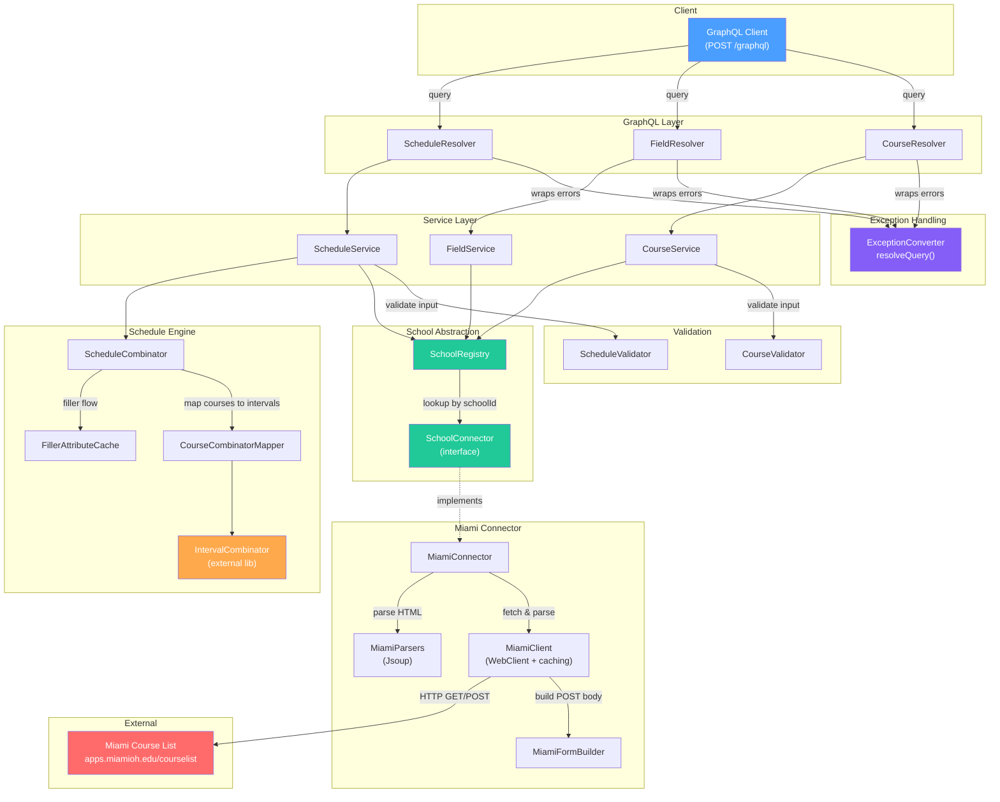
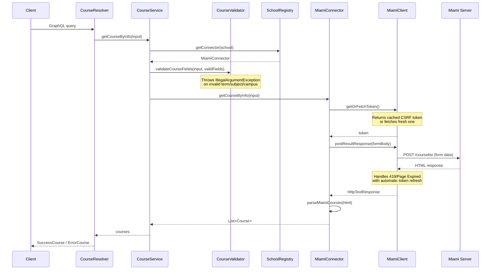
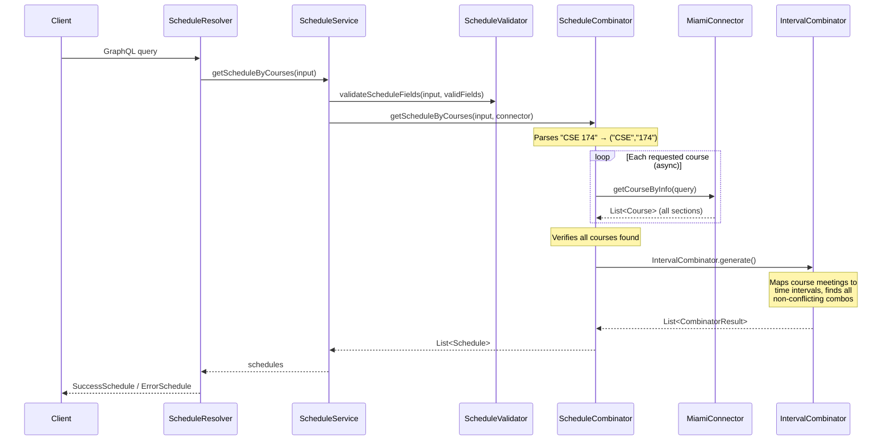
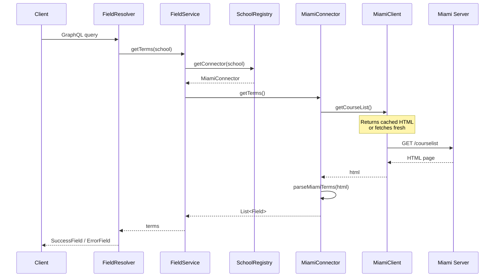

# Miami CourseAPI

[](https://github.com/tomdh-git/Miami-CourseAPI/actions/workflows/gradle.yml)

A SpringBoot GraphQL API for querying Miami University courses, generating conflict-free schedules, and discovering filler classes. Built with Kotlin, Netflix DGS, and the [IntervalCombinator](https://github.com/tomdh-git/interval-combinator) library.

## Architecture



### Query Flows

#### `getCourseByInfo` / `getCourseByCRN` — Course Lookup


#### `getScheduleByCourses` — Schedule Generation


#### `getTerms` — Field Discovery


### Key Design Decisions

| Component | Purpose |
|-----------|---------|
| **SchoolConnector** | Interface for multi-tenant support — add a new school by implementing this interface and registering as a Spring `@Component` |
| **SchoolRegistry** | Auto-discovers all `SchoolConnector` beans via Spring DI, routes requests by `schoolId` |
| **ExceptionConverter** | Catches all exceptions at the resolver boundary and maps them to typed GraphQL error responses (`VALIDATION_ERROR`, `QUERY_ERROR`, `API_ERROR`, `SERVER_BUSY`) |
| **MiamiClient** | Manages CSRF tokens, HTML caching, cookie state, and HTTP retries against Miami's server. Warms up on startup via `@PostConstruct` |
| **ScheduleCombinator** | Fetches all sections concurrently, maps them to time intervals, and delegates to `IntervalCombinator` for conflict-free schedule generation |
| **FillerAttributeCache** | Caches attribute-based course lookups for the filler flow to avoid redundant network calls |

## Testing & CI

This project implements a multi-layer testing strategy fully automated via GitHub Actions:

### 1. Static Analysis (Linting)
We use `ktlint` to enforce consistent Kotlin coding standards.
```bash
./gradlew ktlintCheck
```

### 2. Unit Tests
Uses JUnit 5, Mockito, and MockK for testing business logic, parsers, and validators in isolation.
```bash
./gradlew test
```

### 3. Integration Tests (Smoke Tests)
A "black-box" testing approach that:
1. Boots the full Spring Boot application on a random port.
2. Polls the `/health` endpoint until the system is ready.
3. Executes real GraphQL queries against `localhost` using `scripts/integration-test.sh`.
4. Verifies that real data is fetched from the Miami University servers.

To run manually:
```bash
./gradlew bootRun
# In another terminal:
./scripts/integration-test.sh <PORT_FROM_LOGS>
```

## Host
**WORK IN PROGRESS**
~~CourseAPI is currently being hosted at `https://courseapi-production-3751.up.railway.app`~~

## Requirements
- JDK 21
- Gradle 8.14+

## Local Build and Run

### 1. Clone the repository
```bash
git clone https://github.com/tomdh-git/Miami-CourseAPI.git
cd Miami-CourseAPI
```

### 2. Build the project
```bash
./gradlew clean build
```

### 3. Run the application
```bash
./gradlew bootRun
```
Then the application will be hosted at:
```
http://localhost:8080/graphql
```

## Example Queries

### [getCourseByInfo](https://github.com/tomdh-git/Miami-CourseAPI/blob/master/example_queries/getCourseByInfo.md)
### [getCourseByCRN](https://github.com/tomdh-git/Miami-CourseAPI/blob/master/example_queries/getCourseByCRN.md)
### [getScheduleByCourses](https://github.com/tomdh-git/Miami-CourseAPI/blob/master/example_queries/getScheduleByCourses.md)
### [getFillerByAttributes](https://github.com/tomdh-git/Miami-CourseAPI/blob/master/example_queries/getFillerByAttributes.md)
### [getTerms](https://github.com/tomdh-git/Miami-CourseAPI/blob/master/example_queries/getTerms.md)
